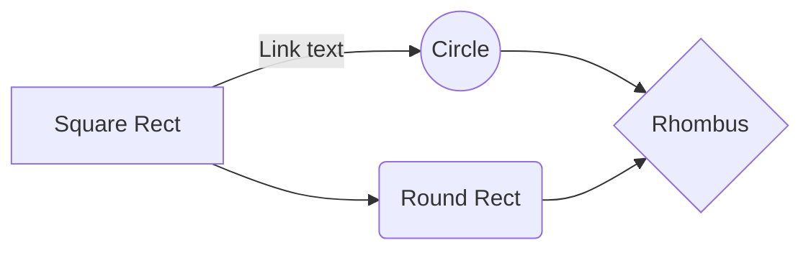

# Normal demo Site

## These reports are of vulnhub s ->     

> This is an output for a info type file
{: .prompt-info }

> Example line for danger prompt.
{: .prompt-danger }

> Example line for warning prompt.
{: .prompt-warning }

> Example line for tip prompt.
{: .prompt-tip }

	
`inline code part`


`/path/to/a/file.extend`{: .filepath}


```
This is a plaintext code snippet.
```

<!--  -->
<p>
<a href="/Vulnhub-Files/img/Bob/Untitled%203.png"></a>
</p>

[Google](https://google.com)

